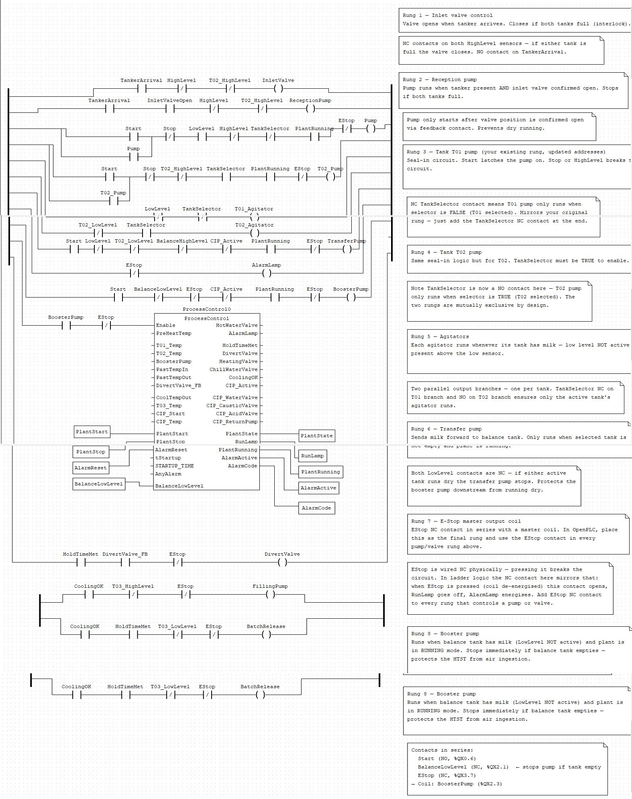
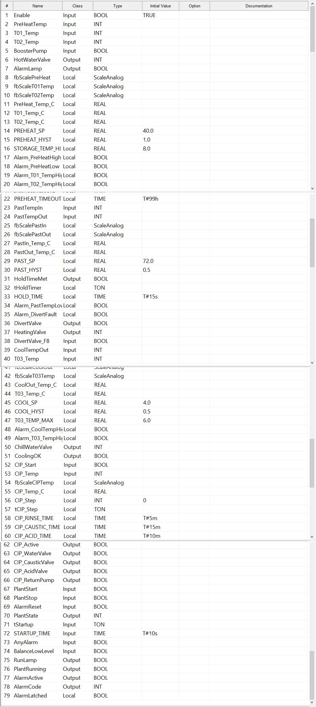
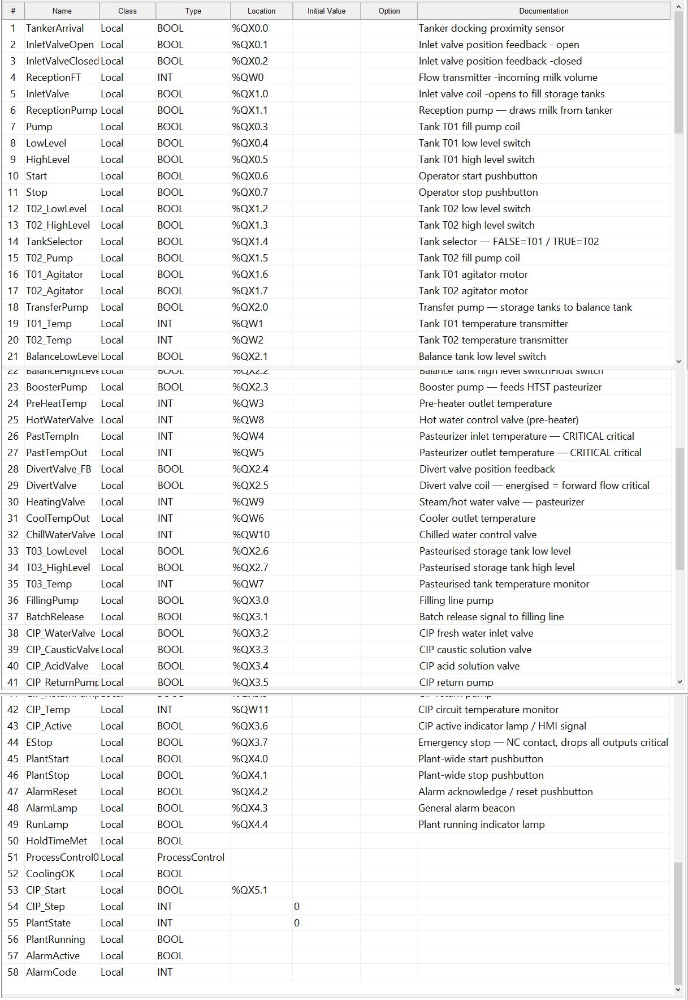

# Milk Pasteurization Plant - Industrial Automation Project

A simulated industrial control system for a six-stage milk pasteurization 
process, built to demonstrate PLC programming, HMI development, and 
industrial communication protocols.

This project showcases the complete automation stack an industrial 
automation engineer would build: ladder logic and structured text control 
programs, a live HMI dashboard, and Modbus TCP/IP communication between 
all layers.

## Acknowledgment

This project was built with the help of Claude AI (Anthropic). Claude 
provided the domain knowledge of how a real milk pasteurization plant is 
structured and sequenced — knowledge I didn't have starting out — and 
co-wrote a significant portion of the structured text process control logic. 
I directed the architecture, built and wired the OpenPLC/Node-RED/Modbus 
integration myself, debugged every connection issue hands-on, and validated 
the system end-to-end through hardware-in-the-loop style testing.

I'm including this for transparency: AI-assisted development is increasingly 
part of real engineering workflows, and I think how you use a tool like this 
well - to learn unfamiliar domains and accelerate implementation while still 
owning the integration and validation - is itself a relevant skill.

## Architecture

The system is built across two layers, communicating over Modbus TCP/IP:

[Node-RED HMI] <----Modbus TCP/IP----> [OpenPLC Runtime]
   (Laptop)                            (Raspberry Pi)

| Layer | Role | Platform |
|---|---|---|
| **OpenPLC Runtime** | Executes ladder logic / structured text control program for the 6-stage pasteurization process | Raspberry Pi |
| **Node-RED** | HMI dashboard - operator controls, live temperature gauges, plant status, alarms, and batch logging | Laptop |

Communication uses Modbus TCP/IP, with Node-RED acting as a Modbus

client reading and writing directly to OpenPLC's memory (coils, discrete

inputs, and registers) to drive the live dashboard.

## Tech Stack

- **OpenPLC Runtime** - open-source PLC runtime executing IEC 61131-3 
  ladder logic and structured text
- **OpenPLC Editor** - used to develop and compile the control program
- **Node-RED** - flow-based HMI dashboard and Modbus client
- **Modbus TCP/IP** - industrial communication protocol linking HMI and PLC
- **Raspberry Pi** - hardware host running the OpenPLC runtime
- **IEC 61131-3 Structured Text** - used for the core process control 
  function block (temperature control, CIP sequencing, alarm logic)

  ## Tech Stack

- **OpenPLC Runtime** - open-source PLC runtime executing IEC 61131-3 
  ladder logic and structured text
- **OpenPLC Editor** - used to develop and compile the control program
- **Node-RED** - flow-based HMI dashboard and Modbus client
- **Modbus TCP/IP** - industrial communication protocol linking HMI and PLC
- **Raspberry Pi** - hardware host running the OpenPLC runtime
- **IEC 61131-3 Structured Text** - used for the core process control 
  function block (temperature control, CIP sequencing, alarm logic)

  ## Process Overview

The control program simulates a six-stage milk pasteurization process:

1. **Reception** - Milk tanker arrival is detected, inlet valve opens, 
   and the reception pump transfers milk into one of two raw storage 
   tanks (T01 / T02), selectable via a tank selector switch.

2. **Storage & Agitation** - Each storage tank runs an agitator whenever 
   milk is present, keeping the product homogenized while awaiting 
   processing.

3. **Pre-Heating** - Milk is transferred to a balance tank, then a 
   booster pump feeds it through a pre-heater. A hot water valve 
   modulates to bring the milk to setpoint (40°C) before entering the 
   pasteurizer.

4. **Pasteurization (HTST)** - The pre-heated milk passes through the 
   High-Temperature Short-Time pasteurizer. A heating valve raises the 
   product to 72°C, and a hold timer ensures the milk stays at 
   temperature for the required hold time. If temperature drops below 
   setpoint, a divert valve redirects the batch away from packaging.

5. **Cooling & Storage** - Pasteurized milk is cooled via a chilled 
   water valve and stored in tank T03, monitored for high/low level 
   and temperature.

6. **CIP (Clean-In-Place)** - A multi-step automated cleaning sequence 
   (rinse → caustic wash → acid wash → final rinse) that can be 
   triggered between batches to clean the process lines.

Throughout all stages, the system includes:
- **Alarm logic** for high/low temperature faults, valve feedback 
  mismatches, and timeout conditions
- **Plant state machine** managing Startup → Running → Alarm → Stopped 
  transitions
- **E-Stop logic** that immediately

- ## Screenshots

### Ladder Logic - Full Control Program

### Process Control - Variable Table

### Tank Level Test Program - Variable Table

### Node-RED HMI Dashboard
[View Node-RED HMI Dashboard (PDF)](node-red/flows/Node-RED_Dashboard.pdf)

## Testing Methodology

The control program was compiled without errors and successfully deployed 
to the OpenPLC runtime on a Raspberry Pi. Communication between Node-RED 
and OpenPLC over Modbus TCP/IP was confirmed working - HMI controls write 
correctly to PLC memory and PLC status reads back to the dashboard in 
real time.

**What this confirms:**
- The ladder logic and structured text compile and run without errors
- Modbus TCP/IP communication is correctly configured and functional 
  end-to-end between HMI and PLC
- Variable addressing and memory mapping are correct

**What has not been validated:**
The full six-stage process - including temperature-driven transitions, 
hold-time logic, and batch logging - requires live temperature input to 
execute. Without physical temperature sensors connected to the Raspberry 
Pi, these analog inputs remain at zero, so process stages that depend on 
temperature thresholds (pre-heat, pasteurization, cooling) cannot 
currently progress through a full batch cycle.

The program is built and ready to run as-is once physical I/O (temperature 
transmitters, flow sensors, and level switches) is connected. No code 
changes are expected to be necessary - only the addition of real input 
signals.

## Repository Structure

milk-pasteurization-plc/
├── README.md
├── docs/
│   └── screenshots/
├── plc/
│   ├── ladder-logic/
│   └── structured-text/
└── node-red/
    └── flows/

    ## What I Learned

This project took me through the full automation development lifecycle - 
not just writing logic, but designing a process from scratch, structuring 
a multi-stage control program, and debugging real communication issues 
between systems.

**Key technical takeaways:**
- **Modbus addressing conventions** - understanding how OpenPLC maps 
  physical I/O versus Modbus slave I/O (e.g. `%QX0.x` for local outputs 
  vs. `%IX100.x` for Modbus-mapped inputs), and how address conflicts 
  between unrelated outputs can cause one control to silently trigger 
  another
- **OpenPLC variable declaration rules** - variables must be declared 
  exclusively in the variable table, not duplicated in Structured Text 
  `VAR` blocks, or the compiler fails
- **Function Blocks vs. Programs** - only Function Blocks can be 
  instantiated and reused inside ladder rungs, which shaped how the core 
  process control logic was structured
- **Debugging a live Modbus connection** - diagnosing connection failures 
  by checking IP configuration, firewall rules, and slave/master roles 
  between systems
- **The difference between "code compiles" and "process is validated"** - 
  and being able to clearly state what was and wasn't proven through 
  testing

**On working with Claude AI:**
I used Claude AI throughout this project, and it played a real role in 
how this came together. I had no prior knowledge of how a milk 
pasteurization plant actually operates — Claude helped me understand the 
real-world process (reception, pre-heating, HTST pasteurization, cooling, 
CIP) well enough to translate it into control logic. Claude also wrote a 
significant portion of the Structured Text process control function 
block, which I then integrated, tested, and debugged within OpenPLC. 
Treating Claude as a collaborator — someone to explain unfamiliar 
concepts and draft code I could then verify and adapt — was a big part 
of how I was able to take this project from an idea to a working PLC 
program.
- 
